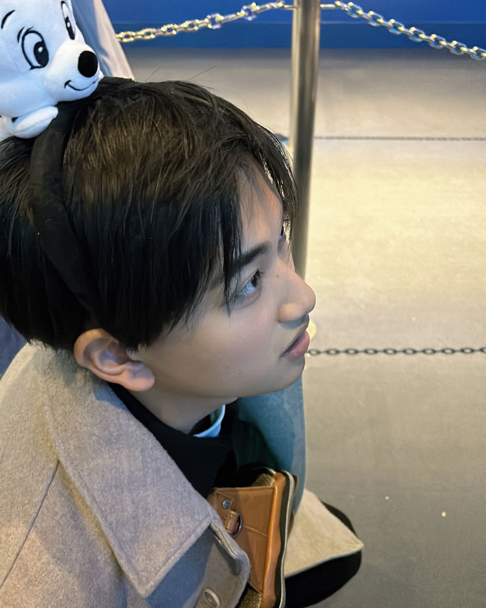

<html lang="ja">
    <head>
        <meta charset="utf-8">
        <meta name="robots" content="noindex,nofollow">
        
        <link rel="stylesheet" href="reset.css">
        <link rel="stylesheet" href="yuki612.css">
        <link rel="stylesheet" href="https://fonts.googleapis.com/css2?family=Amatic+SC&display=swap">
    <title>happy birthday!!</title>
    
    </head>
    <body onload="checkPassword()">
        

        

        

        <h1>happy birthday!!YUKI☻
        </h1>
            

                
            

            

                今回二つのプレゼントを考えました 
                １つ目：Instagramでの専用思い出記録 
                point→かさばらない・いつでもスマホで見返せる 
                ２つ目：プレゼント引換券 
                point→好きな時に渡せる‼‼ 
            
    
            <ul>
         <li><a href="https://www.instagram.com/6.12_h_y?igsh=dGk5cGRncWo1bXg1&utm_source=qr">instagram</a></li>
         <li><a href="yuki162.pdf">プレゼント引換券</a></li>
          </ul>

    </body>
</html>
